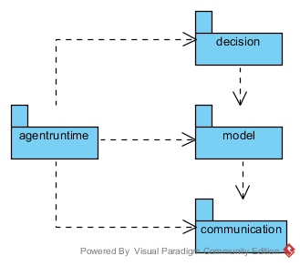
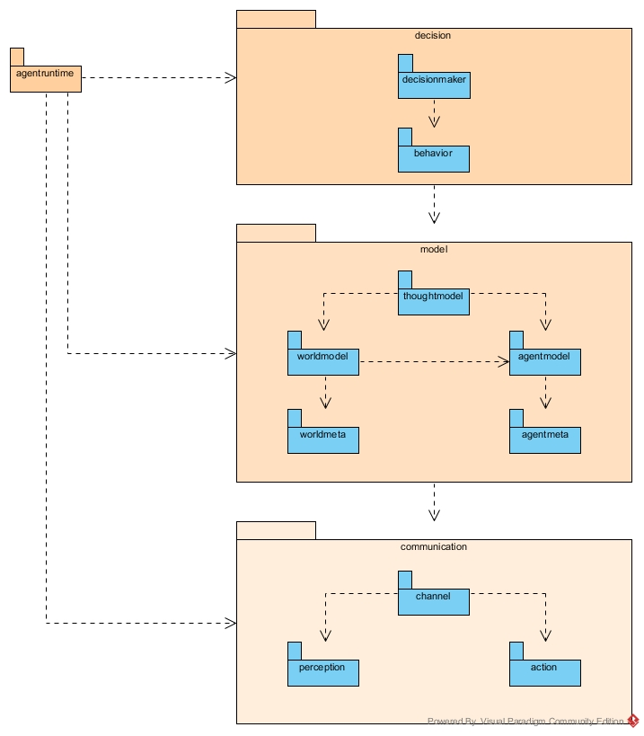

# base

Base classes for all HSOAutonomy projects.

## Architecture

### Maven

Since 2020 we are using maven. Each IDE (Eclipse/IntelliJ etc.) should be able to open the project based on the _pom.xml_.
Therefore all IDE-specific config files are not longer pushed to this repository.
The project is split into different submodules and also defines the most used dependencies.
 
Usually you need the following maven phases:

- `mvn clean`: delete all build files
- `mvn test`: run all tests of this project
- `mvn package`: create JAR-Files of each module
- `mvn verify`: start the maven-dependency analyzer (see below)
- `mvn install`: install the jars to your local maven repository for usage in other projects

We also use the maven-dependency analyzer to check if the dependencies are correctly defined.
Primary it will check for _unused but declared_ and _used but undeclared_ dependencies and the build will fail
when a dependency is violating this check. Main idea is to prevent transitive / hidden dependencies and define all dependencies directly in each submodule.
Since this project is used as a parent for other projects (robocup/taco),
the dependency analyzer is also available for these projects.  

### Top-level

 

### Second-level

 

## Authors
Ester Amelia, Maximilian Baritz, Martin Baur, Nico Bohlinger, Hannes Braun, Kim Christmann, Alexander Derr, 
Klaus Dorer, Mathias Ehret, Sebastian Eppinger, Jens Fischer, 
Camilo Gelvez, Stefan Glaser, Stefan Grossmann, Marcel Gruessinger, Julian Hohenoecker, Danny Huber, Thomas Huber, 
Stephan Kammerer, Fabian Korak, Maximilian Kroeg, Pascal Liegibel, Duy Nguyen, 
Simon Raffeiner, Srinivasa Ragavan, Thomas Rinklin, Bjoern Ritter, 
Mahdi Sadeghi, Joachim Schilling, Rico Schillings, Ingo Schindler, Carmen Schmider, Frederik Sdun, Jannik Seiler, Rajit Shahi, 
Bjoern Weiler, David Weiler, David Zimmermann, Denis Zimmermann
